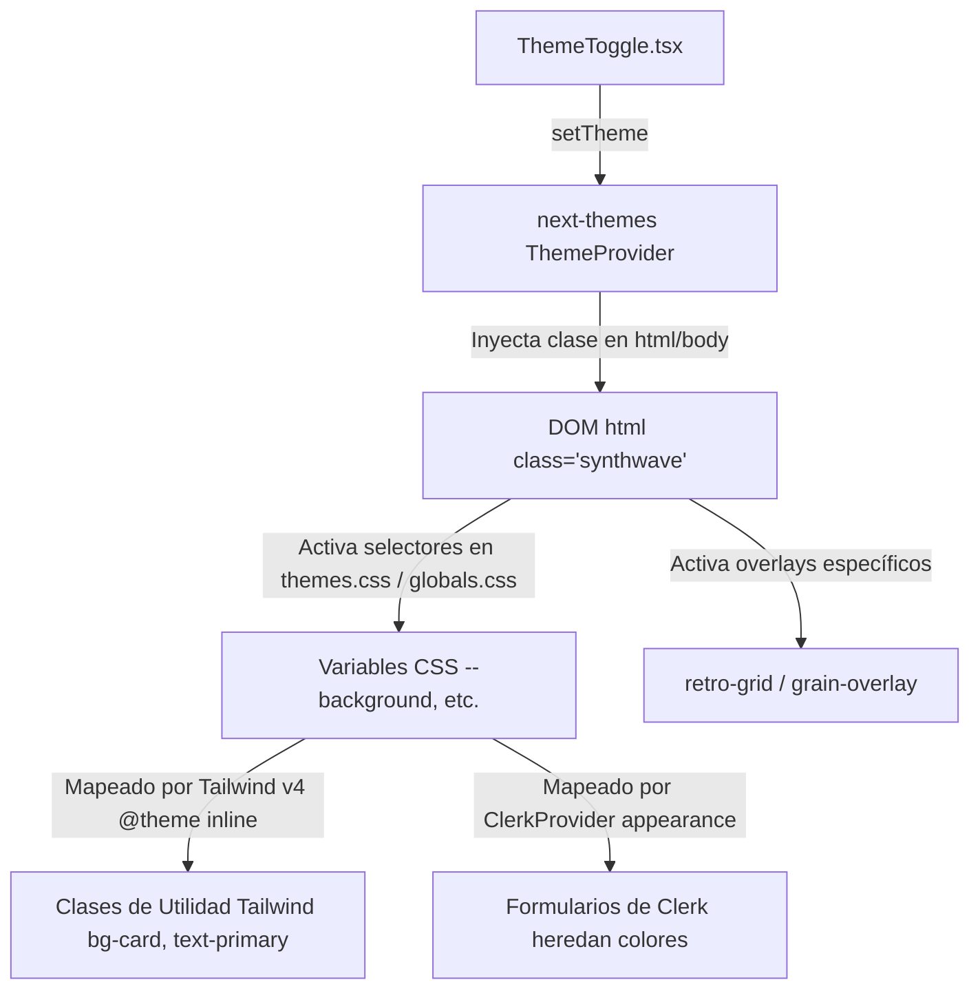

# 🎨 Arquitectura y Guía Técnica de Temas (Eventos HyenUk Chu)

Este documento detalla el funcionamiento interno del motor de temas dinámico de la plataforma, que permite que la interfaz cambie de manera camaleónica a través de 5 temas integrados (`light`, `dark`, `synthwave`, `hacker` y `coffee`). 

---

## ⚙️ Arquitectura Técnica del Motor de Temas

El sistema de temas se implementa combinando tres tecnologías principales: **Next-Themes** (para alternar clases CSS), **Clerk** (para propagar los estilos al flujo de autenticación) y **Tailwind CSS v4** (para inyectar los tokens del tema en las clases de diseño).



### 1. Inyección en el Layout (`app/(public)/layout.tsx`)
El root layout envuelve toda la aplicación en el `ThemeProvider` de `next-themes` configurado de la siguiente manera:
```tsx
<ThemeProvider
  attribute="class"
  defaultTheme="light"
  enableSystem
  disableTransitionOnChange
  themes={["light", "dark", "synthwave", "hacker", "coffee"]}
>
  <div className="retro-grid" />
  {children}
  <div className="grain-overlay" />
</ThemeProvider>
```
*   **`attribute="class"`**: Next-themes añade directamente la clase del tema activo (`.dark`, `.synthwave`, `.hacker`, `.coffee`) a la etiqueta `<html>`, o nada si es `.light`.
*   **Elementos Fijos de Acompañamiento**: Las etiquetas `<div className="retro-grid" />` y `<div className="grain-overlay" />` siempre están montadas en el DOM, pero su visibilidad es controlada dinámicamente mediante CSS en base al tema activo (evitando costo de renderizado/hidratación en JS).

---

## 🖌️ Definiciones de los 5 Temas Reales

Los temas y sus variables están declarados en `app/globals.css` (para el tema `light` base) y `app/themes.css` (para los restantes).

### ☀️ 1. Tema Light (Estándar/Default)
*   **Clase HTML**: `:root` / `.light`
*   **Estética**: Limpio, de alta luminosidad ("Clean UI") con contraste azul.
*   **Colores clave**: `--background: #FFFFFF`, `--foreground: #00030C`, `--primary: #3154DC`.

### 📚 2. Tema Dark ("Libro Viejo")
*   **Clase HTML**: `.dark`
*   **Estética**: Paleta cálida simulando un libro o papiro antiguo para evitar la fatiga visual.
*   **Colores clave**: `--background: #1A1614` (marrón profundo), `--foreground: #E6E2D3` (papiro/hueso), `--card: #241F1C`.
*   **Overlay**: Activa `.grain-overlay` (`display: block` con un filtro SVG de ruido fractal).

### 🌃 3. Tema Synthwave ("Retro-futurismo")
*   **Clase HTML**: `.synthwave`
*   **Estética**: Cyberpunk ochentero, colores neón y rejilla tridimensional.
*   **Colores clave**: `--background: #0d0221` (espacio profundo), `--primary: #bd00ff` (púrpura neón), `--secondary: #01cdfe` (cyan neón).
*   **Overlay**: Activa `.retro-grid` (rejilla animada CSS de gradientes lineales) y `.grain-overlay`.

### 📟 4. Tema Hacker ("Matrix")
*   **Clase HTML**: `.hacker`
*   **Estética**: Terminal monocromática retro.
*   **Colores clave**: `--background: #000500`, `--foreground: #00FF41` (verde fósforo clásico).
*   **Efectos**: Las tarjetas de eventos reciben un `drop-shadow` verde al hacer hover (`.hacker .event-card-wrapper:hover`).

### ☕ 5. Tema Coffee ("Milk & Coffee")
*   **Clase HTML**: `.coffee`
*   **Estética**: Paleta suave de tonos marrón y café con leche.
*   **Colores clave**: `--background: #FDF8F5`, `--foreground: #3E2723`, `--primary: #6D4C41`.

---

## ⚡ Mapeo de Tailwind CSS v4 y Clerk

### Mapeo de Tokens de Tailwind v4 (`app/globals.css`)
Tailwind v4 utiliza `@theme inline` en lugar de `tailwind.config.js`. Todos los tokens del sistema están enlazados a las variables CSS de cada tema:
```css
@theme inline {
  --color-background: var(--background);
  --color-foreground: var(--foreground);
  --color-surface: var(--surface);
  --color-surface-foreground: var(--surface-foreground);
  --color-surface-border: var(--surface-border);
  --color-border: var(--border);
  --color-popover: var(--popover);
  --color-popover-foreground: var(--popover-foreground);
  --color-input: var(--input);
  --color-ring: var(--ring);
  
  /* Hero Tokens */
  --color-hero-badge-bg: var(--hero-badge-bg);
  --color-hero-badge-text: var(--hero-badge-text);
  --color-hero-badge-border: var(--hero-badge-border);
  --color-hero-title: var(--hero-title);
  --color-hero-desc: var(--hero-desc);
  --color-hero-btn-bg: var(--hero-btn-bg);
  --color-hero-btn-text: var(--hero-btn-text);

  /* Tab Tokens */
  --color-logo-color: var(--logo-color);
  --color-tab-active-bg: var(--tab-active-bg);
  --color-tab-active-text: var(--tab-active-text);
  --color-category-tab-active-bg: var(--category-tab-active-bg);
  --color-category-tab-active-text: var(--category-tab-active-text);
  --color-tab-inactive-bg: var(--tab-inactive-bg);
  --color-tab-inactive-text: var(--tab-inactive-text);
  --color-tab-border: var(--tab-border);

  /* Card Tokens */
  --color-card-border: var(--card-border);
  --color-card-title: var(--card-title);
  --color-card-text: var(--card-text);
  --color-card-icon: var(--card-icon);
  --color-card-badge-text: var(--card-badge-text);

  /* Form Tokens */
  --color-form-card-bg: var(--form-card-bg);
  --color-form-card-border: var(--form-card-border);
  --color-form-label: var(--form-label);
  --color-form-input-bg: var(--form-input-bg);
  --color-form-input-border: var(--form-input-border);
  --color-form-input-text: var(--form-input-text);
  --color-form-btn-bg: var(--form-btn-bg);
  --color-form-btn-text: var(--form-btn-text);

  /* Sidebar Tokens */
  --color-sidebar-bg: var(--sidebar-bg);
  --color-sidebar-foreground: var(--sidebar-foreground);

  /* Footer Tokens */
  --color-footer-bg: var(--footer-bg);
  --color-footer-text-primary: var(--footer-text-primary);
  --color-footer-text-secondary: var(--footer-text-secondary);
  --color-social-bg: var(--social-bg);
  --color-social-color: var(--social-color);
  --color-social-hover-bg: var(--social-hover-bg);
  --color-social-hover-color: var(--social-hover-color);

  /* Scrollbar Tokens */
  --color-scrollbar-dot: var(--scrollbar-dot);
  --color-scrollbar-dot-muted: var(--scrollbar-dot-muted);
  --color-scrollbar-sidebar-dot: var(--scrollbar-sidebar-dot);
  --color-scrollbar-track: var(--scrollbar-track);

  /* UI Fallbacks */
  --color-accent: var(--accent);
  --color-accent-foreground: var(--accent-foreground);
  --color-muted: var(--muted);
  --color-muted-foreground: var(--muted-foreground);
  --color-primary: var(--primary);
  --color-primary-foreground: var(--primary-foreground);
  --color-secondary: var(--secondary);
  --color-secondary-foreground: var(--secondary-foreground);
  --color-card: var(--card);
  --color-card-foreground: var(--card-foreground);
  
  --font-sans: var(--font-raleway);
  --font-mono: var(--font-geist-mono);
  
  --radius-md: calc(var(--radius) - 2px);
  --radius-sm: calc(var(--radius) - 4px);
  --radius-lg: var(--radius);
  
  --color-brand-accent: #04C259;
}
```
Esto permite usar clases como `bg-background`, `text-foreground` o `bg-card` directamente en el código de forma camaleónica.

### Integración de Clerk (`ClerkProvider` en `layout.tsx`)
Para evitar que los formularios y modales de autenticación de Clerk rompan la experiencia visual, heredan directamente las variables del tema de la aplicación mediante la prop `appearance`:
```tsx
appearance={{
  variables: {
    colorPrimary: 'var(--primary)',
    colorBackground: 'var(--card)',
    colorForeground: 'var(--foreground)',
    colorInput: 'var(--input)',
    colorInputForeground: 'var(--foreground)',
    colorMutedForeground: 'var(--muted-foreground)',
  },
  elements: {
    card: "!bg-card border border-border rounded-[32px] !text-foreground",
    logoBox: "dark:invert dark:brightness-200 synthwave:invert synthwave:brightness-200 hacker:invert hacker:brightness-200",
    /* ... clases personalizadas adicionales ... */
  }
}}
```
*   **Mapeo de Variables**: El modal de Clerk lee `var(--card)` y `var(--foreground)`, adaptándose dinámicamente si el HTML cambia de clase.
*   **Inversión de Logotipo**: El logo del Club de Inversionistas se invierte automáticamente en brillo y saturación bajo temas oscuros o neón a través de los selectores de Clerk específicos (`logoBox`).

### 🎨 Estilización Camaleónica de Elementos SVG Nativos

Dado que los gráficos SVG vectoriales inline (como el gráfico de tendencia en métricas) se renderizan en un contexto gráfico independiente de HTML, los selectores de clases CSS tradicionales o el uso directo de `hsl(var(--variable))` en los atributos directos del SVG (`fill` o `stroke`) pueden fallar en múltiples navegadores, provocando que los elementos caigan en fallbacks negros.

*   **Regla Obligatoria**: Utilizar variables CSS nativas a nivel de estilos en línea de React para dar color a textos, áreas y trazos vectoriales (ej: `style={{ fill: 'var(--foreground)' }}` o `style={{ stroke: 'var(--border)' }}`).
*   **Adaptabilidad en Tiempo Real**: Al conmutar entre los 5 temas, el motor de Next-Themes actualiza instantáneamente los valores mapeados a las variables CSS. Esto permite que el gráfico adapte sus colores vectoriales al instante y sin necesidad de realizar re-renders en React.

---

## 🛠️ Plantilla de Referencia de Tokens Semánticos

Para añadir un nuevo tema o modificar uno existente en `themes.css`, es obligatorio implementar y declarar las siguientes variables:

### 1. Variables de Estructura e Interfaz
*   `--background`: Fondo de la pantalla principal.
*   `--foreground`: Color del texto principal y títulos.
*   `--card`: Fondo de las tarjetas de eventos y contenedores flotantes.
*   `--card-foreground`: Texto dentro de las tarjetas.
*   `--border` / `--surface-border`: Color de los bordes estructurales.
*   `--input`: Fondo de los elementos de formulario.

### 2. Variables de Scrollbar y Navegación (GSAP)
*   `--scrollbar-dot`: Color del punto de desplazamiento activo en el lateral.
*   `--scrollbar-dot-muted`: Color de los puntos inactivos en el scroll global.
*   `--scrollbar-sidebar-dot`: Color de los puntos del scrollbar en el menú lateral.
*   `--scrollbar-track`: Color de la línea vertical guía (riel) del scroll.

### 3. Efectos Visuales CSS
*   `--logo-color`: Color de acento aplicado al logotipo de la marca.
*   `--radius`: Radio maestro heredado (predeterminado a `32px` / `0.625rem`).

---

## 📝 Reglas de Oro para Diseñadores y Agentes

1. **Nunca usar colores literales en componentes reutilizables**: Clases como `bg-white` o `text-gray-500` están estrictamente prohibidas en el admin y en componentes de uso general. Debe usarse `bg-card`, `bg-muted` o `text-muted-foreground`.
2. **Efectos de Contraste en Temas Oscuros**: Al diseñar un tema oscuro, asegúrate de que `--card` sea ligeramente más claro que `--background` (ej: `#241F1C` frente a `#1A1614` en el tema Dark) para simular profundidad natural sin depender de sombras duras.
3. **Compatibilidad WCAG**: Todo tema agregado debe cumplir con un ratio de contraste mínimo de `4.5:1` entre `--background` y `--foreground` para cumplir con las guías de accesibilidad WCAG AA.

